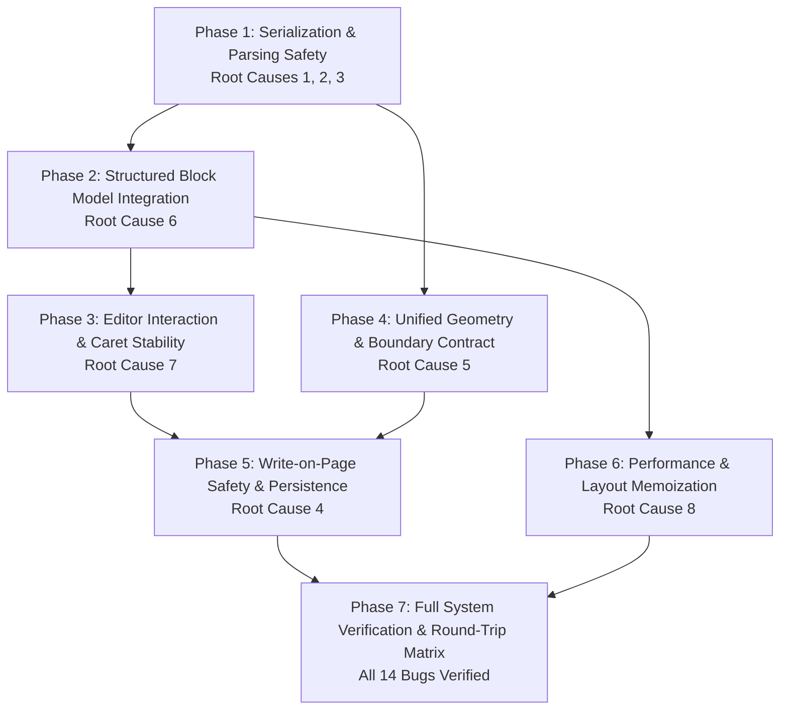

# HandText Document Consistency: Remediation Plan

> [!IMPORTANT]
> **PHASE 0 INVARIANT**: This plan is for architectural review and user approval. **NO CODE MODIFICATIONS** have been implemented during Phase 0. Execution will commence only after explicit user approval.

---

## 1. Executive Summary & Root-Cause Mapping

The 14 discovered bugs are grouped into 8 shared root causes and mapped across 7 phased milestones:

| Root Cause | Affected Bugs | Remediation Phase |
|---|---|:---:|
| **Root Cause 1**: Negated character class regexes (`["']([^"']*)["']`) | `BUG-001` (`x'` truncation), `BUG-005` (Graph def truncation) | **Phase 1** |
| **Root Cause 2**: Missing object serialization in `blocksToHtml` | `BUG-002` (Table cells become `[object Object]`), `BUG-013` (Markdown formatting loss) | **Phase 1** |
| **Root Cause 3**: ContentEditable block nesting in `
` tags | `BUG-003` (Silent deletion of math/graphs in `
`) | **Phase 1 & 3** |
| **Root Cause 4**: Destructive plain-text write-on-page overlay | `BUG-004` (Write-on-page wipes all math/graphs/tables) | **Phase 5** |
| **Root Cause 5**: Divergent geometry (hardcoded 100px vs 72px margin; lineIndex: 0) | `BUG-007` (Table top cuts header), `BUG-008` (Graph top cuts header), `BUG-009` (Margin mismatch) | **Phase 4** |
| **Root Cause 6**: Orphaned `DocumentBlock` model vs raw HTML string | `BUG-006` (Dual divergent architectures), `BUG-012` (Multi-letter function spacing) | **Phase 2** |
| **Root Cause 7**: Caret destruction and global window undo | `BUG-010` (Cursor jumps on prop update), `BUG-011` (Window undo caret drop) | **Phase 3** |
| **Root Cause 8**: Zero layout and math AST memoization | `BUG-014` (Full document re-layout on every keystroke) | **Phase 6** |

---

## 2. Phase Breakdown & Implementation Sequence

### Phase 1: Serialization & Parsing Safety (Root Causes 1, 2, 3)
- **Objective**: Fix attribute quote truncation (`x'`), table `[object Object]` corruption, and block deletion in `
` tags.
- **Affected Files**:
  - `src/lib/handwriting/parse.ts`
  - `src/lib/editor/blockSerialization.ts`
- **Dependencies**: None (immediate safety layer).
- **Migration Strategy**: Backward-compatible attribute reading and table serialization. Legacy documents load without alteration.
- **Implementation Steps**:
  1. Replace all `data-latex=["']([^"']*)["']` with quote-matching regex `data-latex=(["'])([\s\S]*?)\1`.
  2. Serialize table cells as `<${tag}>${segsToHtml(cell.segs) || escapeHtml(cell.text)}</${tag}>` instead of coercing `cell` object to string.
  3. Add an HTML unnesting pre-pass in `parse.ts` to hoist block elements out of `
`.
  4. Fix `GraphBlock` property check in `blockSerialization.ts` line 144.
- **Regression Tests**:
  - Assert `x' = x - min / max - min`, `f'(x)`, `y''` extract full LaTeX string.
  - Assert table cells serialize with rich formatting, never `[object Object]`.
  - Assert `
Text 
...
 Text
` parses into 3 separate blocks.

### Phase 2: Structured Block Model Integration (Root Cause 6)
- **Objective**: Establish `DocumentBlock[]` as the canonical document intermediate representation, bridging `RichContentEditor` and `layoutDocument`.
- **Affected Files**:
  - `src/types/document.ts`
  - `src/lib/editor/blockSerialization.ts`
  - `src/lib/handwriting/parse.ts`
  - `src/lib/handwriting/layout.ts`
  - `src/lib/math/tokens.ts`
- **Dependencies**: Phase 1.
- **Migration Strategy**: `htmlToBlocks` converts legacy HTML to `DocumentBlock[]`; `blocksToHtml` converts back for saving/exporting.
- **Implementation Steps**:
  1. Harmonize `DocumentBlock` and `Block` interfaces into a single shared contract.
  2. Overload `layoutDocument` to accept `Block[] | DocumentBlock[]` directly, eliminating regex re-parsing.
  3. Recognize common multi-letter math identifiers (`min`, `max`, `sin`, `cos`, `log`) in `tokens.ts`.
- **Regression Tests**:
  - Round-trip tests: `DocumentBlock[] -> HTML -> DocumentBlock[]`.
  - Layout parity: Verify typed block layout produces identical results to clean HTML.

### Phase 3: Editor Interaction & Caret Stability (Root Cause 7)
- **Objective**: Eliminate cursor jumps, DOM node resets, and unhandled undo desynchronization.
- **Affected Files**:
  - `src/components/editor/RichContentEditor.tsx`
  - `src/components/editor/EditorWorkspace.tsx`
- **Dependencies**: Phase 1, Phase 2.
- **Migration Strategy**: Non-breaking editor component refactor.
- **Implementation Steps**:
  1. Do not overwrite `el.innerHTML` during user typing when content is semantically identical.
  2. In insertion and paste handlers, cleanly split paragraphs at the caret instead of inserting `
` inside `
`.
  3. Defer Ctrl+Z to native contentEditable undo while editor has active focus.
- **Regression Tests**:
  - Rapid typing test verifying cursor does not jump to offset 0.
  - Backspace on MathBlock cleanly removes the block without breaking adjacent paragraphs.

### Phase 4: Unified Layout & Authoritative Geometry Contract (Root Cause 5)
- **Objective**: Align margin widths and ruling line boundaries across Left Editor and Right Canvas.
- **Affected Files**:
  - `src/lib/handwriting/layout.ts`
  - `src/lib/handwriting/renderer.ts`
  - `src/components/editor/RichContentEditor.tsx`
- **Dependencies**: Phase 1.
- **Migration Strategy**: Dynamic parameterization of margin and line boundary coordinates.
- **Implementation Steps**:
  1. Bind canvas `marginRuleX` dynamically to `settings.page.answerMargin?.width ?? 72` instead of hardcoded `100`.
  2. Clamp table top boundary to `coordinates.contentTop` when `lineIndex === 0` to prevent page header overlap.
  3. Clamp graph top boundary to `coordinates.contentTop` when `lineIndex === 0`.
- **Regression Tests**:
  - Assert changing Answer Margin width updates both editor gutter and canvas ruling consistently.
  - Assert table placed at `lineIndex: 0` does not render borders above `contentTop`.

### Phase 5: Write-on-Page Safety & Non-Destructive Persistence (Root Cause 4)
- **Objective**: Protect all non-text blocks from destruction during write-on-page editing.
- **Affected Files**:
  - `src/components/editor/EditorWorkspace.tsx`
  - `src/lib/handwriting/parse.ts`
  - `src/hooks/useProjectPersistence.ts`
- **Dependencies**: Phase 3, Phase 4.
- **Migration Strategy**: Replace full-document plain text overlay with line/block targeted editing.
- **Implementation Steps**:
  1. Target on-page typing to the specific clicked line/block without running destructive `htmlToPlainText -> plainTextToHtml`.
  2. Update `htmlToPlainText` and `plainTextToHtml` so math, tables, and graphs are never converted to flat `
` tags.
- **Regression Tests**:
  - Assert typing on a page with existing MathBlocks and Tables leaves all non-text blocks 100% intact.

### Phase 6: Performance & Layout Memoization (Root Cause 8)
- **Objective**: Eliminate typing lag by caching math AST parsing and layout box measurements.
- **Affected Files**:
  - `src/lib/math/layout.ts`
  - `src/lib/handwriting/layout.ts`
  - `src/components/editor/EditorWorkspace.tsx`
- **Dependencies**: Phase 2.
- **Implementation Steps**:
  1. Add LRU cache in `layoutMath` keyed by `(latex, fontSize, scale)`.
  2. In `buildFlow`, memoize laid-out lines for unchanged blocks.
- **Regression Tests**:
  - Assert <10ms layout execution per keystroke on a 5-page document with 10 math formulas.

### Phase 7: Full System Verification & Round-Trip Matrix
- **Objective**: End-to-end verification of all 14 discovered bugs using automated tests and headless browser UAT.
- **Execution**:
  - Run all automated regression test suites.
  - Verify all 14 bug reproduction scenarios in `REPRODUCTION.md`.
  - Perform browser verification on live application.

---

## 3. Files Likely to Change vs Files That Must NOT Change

### Files Likely to Change
- `src/lib/handwriting/parse.ts` (attribute regexes, table cell serialization, block hoisting)
- `src/lib/editor/blockSerialization.ts` (attribute quote matching, GraphBlock contract)
- `src/types/document.ts` (block contract harmonization)
- `src/lib/handwriting/layout.ts` (dynamic margin width, table pagination line 0 clamping)
- `src/lib/handwriting/renderer.ts` (table/graph boundary clamping to `contentTop`)
- `src/components/editor/RichContentEditor.tsx` (paragraph splitting on block insert, stable value comparison)
- `src/components/editor/EditorWorkspace.tsx` (write-on-page block-safe editing, typed block layout pipe)
- `src/lib/math/tokens.ts` (multi-letter math identifier recognition)
- `src/lib/math/layout.ts` (math layout box caching)

### Files That Must NOT Change
- `src/lib/math/parser.ts` & `src/lib/math/layout.ts` core math box sizing and rendering logic
- `src/lib/handwriting/pen.ts` & handwriting stroke algorithms
- `src/lib/auth/*` & `src/routes/auth.tsx`
- `src/lib/supabase/*` (client and database configuration)
- `src/lib/export/*` (PDF/PNG/ZIP generators)
- `src/components/ThemeToggle.tsx` & Dark Mode CSS themes
- Page limits, user quotas, and billing logic

---

## 4. Definition of Done (DoD) for Each Phase

- **Phase 1 DoD**: `tests/test-math-parser.ts` and `tests/test-table-operations.test.ts` pass with zero failures. Formula `x' = x - min / max - min` extracts full LaTeX. Table serialization produces zero `[object Object]` strings.
- **Phase 2 DoD**: `DocumentBlock[]` passes round-trip tests through `blockSerialization.ts`. `layoutDocument` executes directly from typed blocks.
- **Phase 3 DoD**: Rapid typing does not reset the cursor to position 0. Inserting a MathBlock inside text splits the paragraph cleanly with zero nested `
` tags.
- **Phase 4 DoD**: Setting Answer Margin to 90px in settings updates both left editor gutter and right canvas ruling to 90px. Table at `lineIndex: 0` does not overlap the page header.
- **Phase 5 DoD**: Typing in "Write on page" does not erase or modify existing MathBlocks, Tables, or GraphBlocks.
- **Phase 6 DoD**: Math layout box cache achieves >80% hit rate during continuous editing. Canvas redraw latency remains under 16ms.
- **Phase 7 DoD**: All 14 reproduction test cases in `REPRODUCTION.md` pass with 100% success. Full regression suite passes cleanly.
