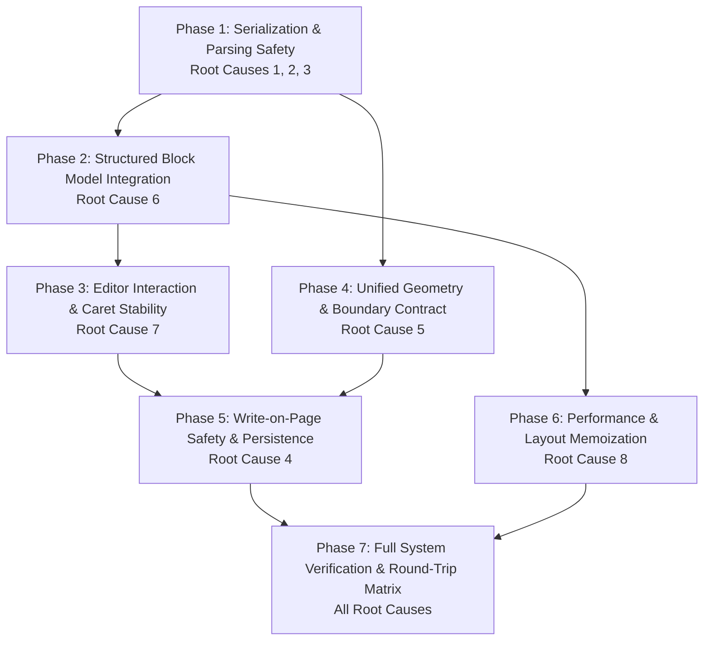

# Production-Safe Remediation Plan: HandText Document Consistency

> **Phase**: Production Remediation Planning  
> **Target**: Resolve 14 discovered bugs across 8 root causes without rewriting working product code.  
> **Status**: Review & User Approval Gate (No production code modified).

---

## 1. Executive Strategy & Architectural North Star

### Architectural Evolution
We move the system from a fragile, regex-parsed string architecture to a robust, typed document architecture:

```
CURRENT (Brittle):
contentEditable DOM ──[el.innerHTML]──► Raw HTML String ──[Regex Parser]──► Ephemeral Block[] ──► Canvas
                                           ▲ (Quotes truncate,
                                              nested tags delete blocks)

TARGET (Robust & Backward-Compatible):
Document Source of Truth (DocumentBlock[] / Canonical Block Model)
       │
       ├──► Editor UI (RichContentEditor with structured block nodes & caret preservation)
       │
       ├──► Persistence (Lossless HTML/JSON with 100% backward compatibility for legacy drafts)
       │
       └──► Layout Engine (layoutDocument receives typed blocks directly without regex parsing)
              │
              └──► Handwritten Canvas Renderer (Consistent geometry, rulings & baselines)
```

### Core Design Rules
1. **Never parse HTML attributes with `[^"']*`**: Always use strict quote-paired delimiters `=(["'])([\s\S]*?)\1` or native DOM attribute readers.
2. **Never serialize JavaScript objects using default string coercion**: Never allow `<${tag}>${cell}</${tag}>` to turn cells into `[object Object]`.
3. **Never allow block-level items inside paragraph tags**: Hoist or split `<div class="math-block">`, `<div class="graph-block">`, and `<table>` out of `<p>`.
4. **Never destroy structured blocks during "Write on Page"**: The handwriting overlay must edit text lines selectively, never replacing the document with flat `<p>` tags.
5. **One Authoritative Geometry**: Editor margin gutter and canvas ruling margin must derive dynamically from `settings.page.answerMargin.width`.

---

## 2. Phased Implementation Roadmap



---

### Phase 1: Serialization & Parsing Safety (Root Causes 1, 2, 3)

**Objective**: Stop immediate data corruption, quote truncation, and silent block deletion in existing parsers and serializers without breaking HTML compatibility.

- **Bugs Addressed**: `BUG-CONSISTENCY-001`, `BUG-CONSISTENCY-002`, `BUG-CONSISTENCY-003`, `BUG-CONSISTENCY-005`.
- **Affected Files**:
  - `src/lib/handwriting/parse.ts`
  - `src/lib/editor/blockSerialization.ts`
- **Implementation Steps**:
  1. **Quote-Paired Attribute Extraction**:
     In `parse.ts` (lines 480, 546, 711, 729, 748, 1246) and `blockSerialization.ts` (lines 341, 441), replace all instances of:
     ```ts
     data-latex=["']([^"']*)["']
     ```
     with quote-paired backreferences or an attribute extraction helper:
     ```ts
     data-latex=(["'])([\s\S]*?)\1
     ```
     This immediately restores single-quote formulas (`x' = x - min / max - min`, `f'(x)`, `y''`, `\text{it's}`) so they never truncate.
  2. **Table Cell Serialization Fix**:
     In `src/lib/handwriting/parse.ts` line 1155, replace:
     ```ts
     const cells = row.map((cell) => `<${tag}>${cell}</${tag}>`).join("");
     ```
     with structured cell serialization:
     ```ts
     const cells = row.map((cell) => {
       const cellHtml = typeof cell === "string" 
         ? escapeHtml(cell) 
         : (cell.segs && cell.segs.length > 0 ? segsToHtml(cell.segs) : escapeHtml(cell.text || ""));
       return `<${tag}>${cellHtml}</${tag}>`;
     }).join("");
     ```
  3. **Nested Block Hoisting / Pre-Pass**:
     In `src/lib/handwriting/parse.ts`, before `blockRegex` runs, unwrap/hoist any block tokens (`<p data-math-token="...">`, `<div class="math-block">`, `<table>`, `<div class="graph-block">`) trapped inside `<p>` or `<div>` tags so that nested elements are cleanly separated into sequential blocks.
  4. **GraphBlock Property Alignment**:
     Fix `src/lib/editor/blockSerialization.ts` line 144 to safely access `(block.graphDef || (block as any).graph?.definition)?.title || "Graph"`.
- **Regression Tests**:
  - `tests/test-math-parser.ts`: Assert `x' = x - min / max - min`, `f'(x)`, `y''` extract full LaTeX string.
  - `tests/test-table-operations.test.ts`: Assert table cells serialize with rich formatting, never `[object Object]`.
  - `tests/test-phase2-editor-blocks.ts`: Assert `<p>Text <div class="math-block">...</div> Text</p>` parses into 3 separate blocks.

---

### Phase 2: Structured Block Model Integration (Root Cause 6)

**Objective**: Unify the orphaned `DocumentBlock` model with the active layout pipeline so that `layoutDocument` can consume typed blocks directly without lossy regex re-parsing.

- **Bugs Addressed**: `BUG-CONSISTENCY-006`, `BUG-CONSISTENCY-012`.
- **Affected Files**:
  - `src/types/document.ts`
  - `src/lib/editor/blockSerialization.ts`
  - `src/lib/handwriting/parse.ts`
  - `src/lib/handwriting/layout.ts`
  - `src/lib/math/tokens.ts`
- **Implementation Steps**:
  1. **Canonical Block Contract**:
     Harmonize `types/document.ts` (`DocumentBlock`) with `parse.ts` (`Block`). Ensure property names (`graphDef` vs `graph.definition`, `tableData` vs `table`) are mapped symmetrically with zero data loss.
  2. **Direct Block Layout Overload**:
     Update `layoutDocument` in `src/lib/handwriting/layout.ts` to accept `Block[] | DocumentBlock[]` directly:
     ```ts
     export function layoutDocument(
       ctx: CanvasRenderingContext2D,
       input: { question?: string; content: string | Block[]; settings: HandwritingSettings }
     ): LayoutDocument
     ```
     When `input.content` is already an array of blocks, bypass the regex HTML parser entirely.
  3. **Multi-Letter Identifier Recognition**:
     In `src/lib/math/tokens.ts`, recognize standard unescaped math function identifiers (`min`, `max`, `sin`, `cos`, `tan`, `log`, `ln`, `exp`, `det`, `lim`) as named function tokens rather than splintering them into separate single-letter italic variables with awkward gaps.
- **Regression Tests**:
  - `tests/test-block-serialization.ts`: Verify full lossless round-trips: `DocumentBlock[] -> HTML -> DocumentBlock[]`.
  - `tests/test-layout-inspect.ts`: Verify `layoutDocument` with typed blocks produces identical layout to clean HTML.

---

### Phase 3: Editor Interaction & Caret Stability (Root Cause 7)

**Objective**: Prevent caret jumps, DOM node recreation, and editing desynchronization in `RichContentEditor.tsx`.

- **Bugs Addressed**: `BUG-CONSISTENCY-010`, `BUG-CONSISTENCY-011`.
- **Affected Files**:
  - `src/components/editor/RichContentEditor.tsx`
  - `src/components/editor/EditorWorkspace.tsx`
- **Implementation Steps**:
  1. **Non-Destructive DOM Synchronization**:
     In `RichContentEditor.tsx` (lines 679-698), replace primitive HTML string equality check `if (el.innerHTML !== normalized)` with a semantic check or guard `if (isFocusedRef.current) return;`. When the editor has active user focus, external prop updates that match the current content semantically must NOT overwrite `el.innerHTML`.
  2. **Paragraph Splitting on Insertion**:
     In `insertMathBlock`, `pasteMathBlock`, and `insertGraphBlock`, if the selection is inside a non-empty paragraph, split the paragraph at the caret into `p1`, insert `mathDiv`, and create `p2`, placing the cursor in `p2`. Never insert block `<div>` elements inside inline `<p>` tags.
  3. **Context-Aware Undo Stack**:
     In `EditorWorkspace.tsx`, modify the window-level `keydown` listener for Ctrl+Z: if `document.activeElement` is inside `editorRef.current`, let the browser's native `contentEditable` undo stack handle text-level undo to preserve character-level caret position. Use `past.current` only for structural block additions/removals and setting changes.
- **Regression Tests**:
  - Interaction test: Rapid typing test verifying cursor does not jump to offset 0.
  - Keyboard navigation test: Backspace on MathBlock removes block cleanly without leaving orphaned `<br>` or deleting adjacent paragraphs.

---

### Phase 4: Unified Layout & Authoritative Geometry Contract (Root Cause 5)

**Objective**: Eliminate hardcoded coordinate constants and align margin and ruling line calculations across Editor and Canvas.

- **Bugs Addressed**: `BUG-CONSISTENCY-007`, `BUG-CONSISTENCY-008`, `BUG-CONSISTENCY-009`.
- **Affected Files**:
  - `src/lib/handwriting/layout.ts`
  - `src/lib/handwriting/renderer.ts`
  - `src/components/editor/RichContentEditor.tsx`
- **Implementation Steps**:
  1. **Dynamic Answer Margin Width**:
     In `src/lib/handwriting/layout.ts` line 400, replace the hardcoded literal `100` with the actual setting value:
     ```ts
     const marginWidth = settings.page.answerMargin?.width ?? 72;
     const marginRuleX = settings.page.margin.enabled
       ? settings.page.margin.position
       : (isAnswerMarginEnabled && (settings.page.answerMargin?.showDivider !== false) ? marginWidth : 0);
     ```
     Ensure `RichContentEditor.tsx` reads `answerMargin?.width ?? 72` so that both left editor and right canvas always share the exact same pixel boundary.
  2. **Table Top Boundary Clamping**:
     In `src/lib/handwriting/renderer.ts` line 470, replace:
     ```ts
     const top = getBaseline(coordinates, placement.lineIndex - 1);
     ```
     with boundary-safe positioning:
     ```ts
     const top = placement.lineIndex === 0
       ? coordinates.firstBaselineY - coordinates.rulingSpacing * 0.75
       : getBaseline(coordinates, placement.lineIndex - 1);
     ```
     When a table is placed at `lineIndex: 0` (first line of page or repeated header), the top border is clamped strictly below `coordinates.headerHeight`, preventing visual collisions with the page header.
  3. **Graph Block Top Clamping**:
     In `src/lib/handwriting/renderer.ts` line 454, ensure `topY` is clamped so it never enters the header band when placed at `lineIndex: 0`.
- **Regression Tests**:
  - `tests/test-answer-margin-phase2.ts`: Assert margin position matches across editor and canvas for custom widths (e.g. 72px, 90px, 120px).
  - `tests/test-table-cell-height.ts`: Assert table placed at `lineIndex: 0` does not render borders above `contentTop`.

---

### Phase 5: Write-on-Page Safety & Non-Destructive Persistence (Root Cause 4)

**Objective**: Protect all non-text blocks (Math, Tables, Graphs, Colors) from destruction during write-on-page interactions and autosave cycles.

- **Bugs Addressed**: `BUG-CONSISTENCY-004`.
- **Affected Files**:
  - `src/components/editor/EditorWorkspace.tsx`
  - `src/lib/handwriting/parse.ts`
  - `src/hooks/useProjectPersistence.ts`
- **Implementation Steps**:
  1. **Block-Preserving Write-on-Page**:
     In `EditorWorkspace.tsx` (lines 734-741), replace the destructive `htmlToPlainText(content) -> plainTextToHtml(e.target.value)` overlay.
     Instead, when the user types on page:
     - Target the specific text block corresponding to the clicked page line (`getLineIndexAtPageY`).
     - Update only that specific block's text while leaving all preceding and following MathBlocks, TableBlocks, and GraphBlocks intact.
     - Alternatively, if the document contains non-text blocks, present a line-targeted overlay rather than converting the entire document into plain `<p>` tags.
  2. **Non-Destructive Plain-Text Conversion**:
     In `src/lib/handwriting/parse.ts`, update `htmlToPlainText` so that math blocks retain their full LaTeX without quote truncation, and tables retain markdown pipe syntax. Update `plainTextToHtml` so it does not collapse custom blocks.
- **Regression Tests**:
  - `tests/test-write-on-page.test.ts`: Insert MathBlock and Table, simulate typing a character in the on-page overlay, assert MathBlock and Table remain 100% intact with zero data loss.

---

### Phase 6: Performance & Layout Memoization (Root Cause 8)

**Objective**: Eliminate typing latency and unnecessary CPU overhead by caching expensive math AST parsing and layout box measurements.

- **Bugs Addressed**: `BUG-CONSISTENCY-014`.
- **Affected Files**:
  - `src/lib/math/layout.ts`
  - `src/lib/handwriting/layout.ts`
  - `src/components/editor/EditorWorkspace.tsx`
- **Implementation Steps**:
  1. **Math Layout Box LRU Cache**:
     In `src/lib/math/layout.ts`, introduce an in-memory cache keyed by `(latex, fontSize, scale)`. Since mathematical formulas rarely change between keystrokes in surrounding text, repeated calls to `layoutMath` return the cached `MathLayoutBox` in O(1) time without re-computing bounding boxes or re-running recursive descent parsing.
  2. **Block-Level Layout Memoization**:
     In `src/lib/handwriting/layout.ts`, when rebuilding the flow list in `buildFlow`, memoize the laid-out lines for unchanged blocks. If only Block 3 was edited, reuse the cached lines for Block 1 and Block 2.
- **Regression Tests**:
  - Performance test: Measure layout execution time on a 5-page document with 10 math formulas across 50 simulated keystrokes. Assert <10ms execution per keystroke.

---

### Phase 7: Full System Verification & Round-Trip Matrix

**Objective**: Execute comprehensive automated tests, headless browser validation, and user acceptance scenarios across all 14 bug reproductions.

- **Verification Matrix**:
  1. **Math Formatting**: Single quotes (`x'`), derivatives (`f'(x)`), double primes (`y''`), fractions (`\frac{a}{b}`), matrices, roots, Greek letters, inline colors.
  2. **Table Operations**: Multiline cells, whitespace, column alignments, repeated headers, row/column insertion.
  3. **Block Transitions**: Text → Math → Text, Math → Table → Math, consecutive MathBlocks, empty blocks.
  4. **Persistence**: Save → reload → restore from IndexedDB and Supabase.
  5. **Visual Parity**: Pixel-level comparison between Left Digital representation and Right Handwritten canvas output.

---

## 3. Backward-Compatible Migration Strategy

Existing projects in Supabase and IndexedDB store HTML strings. The migration path guarantees zero data loss:

```
Existing Project HTML in DB
           │
           ▼
[Backward-Compatible Parser (Phase 1 & 2)]
  - Tolerates legacy unadorned <div class="math-block" data-latex="...">
  - Tolerates hybrid <div data-block-type="text"> wrappers
  - Tolerates legacy markdown markers (**, __)
           │
           ▼
[Typed In-Memory DocumentBlock[]]
  - Stable UUID block IDs assigned
  - Math expressions parsed into canonical LaTeX
  - Tables structured as TableCellData[][]
           │
           ▼
[Lossless HTML Serialization]
  - Saved back to DB with semantic data-block-id and data-block-type attributes
  - 100% backward-compatible with external viewers, export tools, and older clients
```

---

## 4. Files Likely to Change vs Files That Must NOT Change

### Files Likely to Change
- `src/lib/handwriting/parse.ts` (attribute regexes, table cell serialization, block hoisting)
- `src/lib/editor/blockSerialization.ts` (attribute quote matching, GraphBlock contract)
- `src/types/document.ts` (block contract harmonization)
- `src/lib/handwriting/layout.ts` (dynamic margin width, table pagination line 0 clamping)
- `src/lib/handwriting/renderer.ts` (table/graph boundary clamping to `contentTop`)
- `src/components/editor/RichContentEditor.tsx` (paragraph splitting on block insert, stable value comparison)
- `src/components/editor/EditorWorkspace.tsx` (write-on-page block-safe editing, typed block layout pipe)
- `src/lib/math/tokens.ts` (multi-letter math identifier recognition)
- `src/lib/math/layout.ts` (math layout box caching)

### Files That Must NOT Change
- `src/lib/math/parser.ts` & `src/lib/math/layout.ts` core math box sizing and rendering logic
- `src/lib/handwriting/pen.ts` & handwriting stroke algorithms
- `src/lib/auth/*` & `src/routes/auth.tsx`
- `src/lib/supabase/*` (client and database configuration)
- `src/lib/export/*` (PDF/PNG/ZIP generators)
- `src/components/ThemeToggle.tsx` & Dark Mode CSS themes
- Page limits, user quotas, and billing logic

---

## 5. Definition of Done (DoD) for Each Phase

- **Phase 1 DoD**: `tests/test-math-parser.ts` and `tests/test-table-operations.test.ts` pass with zero failures. Formula `x' = x - min / max - min` extracts full LaTeX. Table serialization produces zero `[object Object]` strings.
- **Phase 2 DoD**: `DocumentBlock[]` passes round-trip tests through `blockSerialization.ts`. `layoutDocument` executes directly from typed blocks.
- **Phase 3 DoD**: Rapid typing does not reset the cursor to position 0. Inserting a MathBlock inside text splits the paragraph cleanly with zero nested `<div>` tags.
- **Phase 4 DoD**: Setting Answer Margin to 90px in settings updates both left editor gutter and right canvas ruling to 90px. Table at `lineIndex: 0` does not overlap the page header.
- **Phase 5 DoD**: Typing in "Write on page" does not erase or modify existing MathBlocks, Tables, or GraphBlocks.
- **Phase 6 DoD**: Math layout box cache achieves >80% hit rate during continuous editing. Canvas redraw latency remains under 16ms.
- **Phase 7 DoD**: All 14 reproduction test cases in `REPRODUCTION.md` pass with 100% success. Full regression suite passes cleanly.
