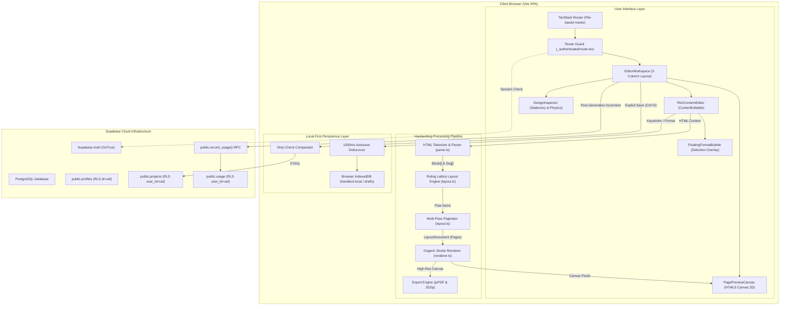
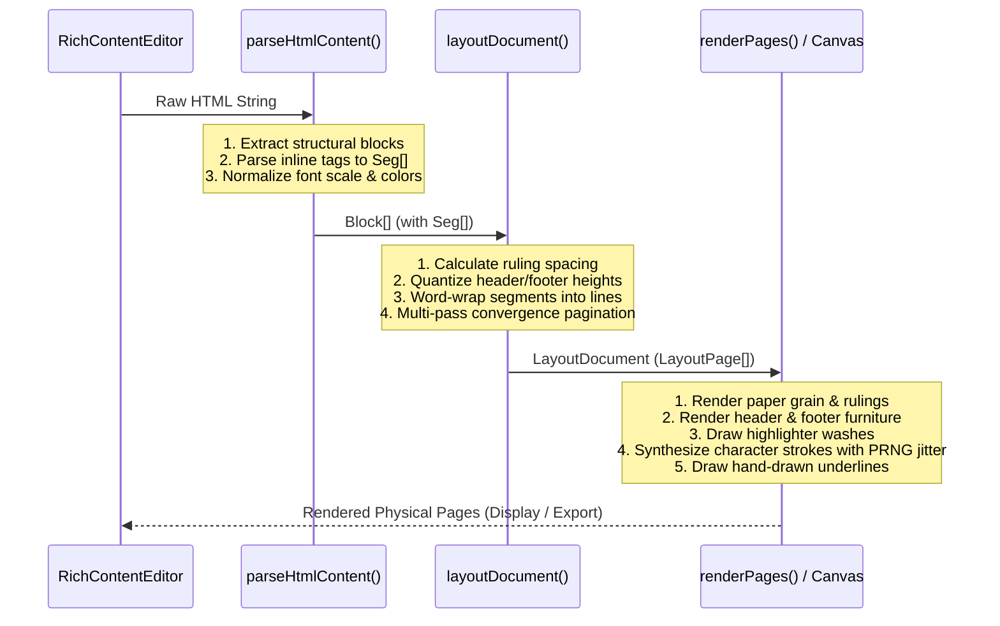
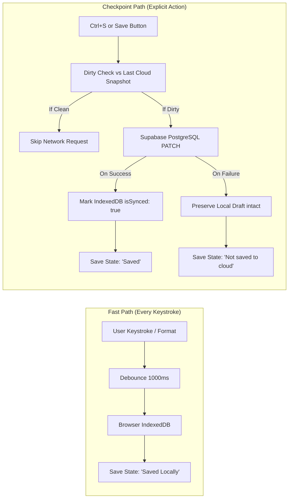

# HandText — Technical Architecture

> **System Architecture, Subsystems, and State Flow**  
> *Target Audience:* Software Architects, Core Engineers, AI Agents  
> *Last Updated:* September 2026  
> *Document Status:* Active & Canonical

---

## 1. System Overview

HandText is architected as a **Client-Side Heavy, Local-First Single Page Application (SPA)** backed by managed cloud persistence and authentication services. The core computational workload—rich text parsing, physical ruling layout, multi-pass pagination, organic stroke synthesis, and canvas rasterization—runs completely client-side in the user's browser using web-standard HTML5 2D Canvas APIs.

Cloud interactions with Supabase are strictly decoupled from editing keystrokes, protecting both user responsiveness and server scalability.

---

## 2. High-Level Architecture Diagram

---

## 3. Subsystem Breakdown

### 3.1 Routing & Authentication Subsystem
- **Routing Engine**: `@tanstack/react-router` provides type-safe client-side routing.
  - Public routes: `/` (Landing page) and `/auth` (Authentication & password recovery).
  - Authenticated layout: `_authenticated/route.tsx`.
- **Session Verification**: The layout route executes `supabase.auth.getUser()` in its `beforeLoad` hook.
  - If no active session exists and running in production: immediately throws a redirect to `/auth`.
  - Development Bypass Guardrail: If `import.meta.env.DEV` is true and hostname is `localhost` or `127.0.0.1`, a mock local user is provided to allow offline UI testing without triggering external authentication rate limits.

### 3.2 Editor & Selection Formatting Subsystem
- **DOM Container**: `RichContentEditor.tsx` encapsulates a `contenteditable` `div`.
- **Formatting Execution**: Formatting is executed through standard DOM APIs (`document.execCommand` and selection wrapping via `` tags with data attributes).
- **Floating Controls**: `FloatingFormatBubble.tsx` dynamically calculates coordinates using `window.getSelection().getRangeAt(0).getBoundingClientRect()` and positions a compact action pill directly above the selection.
- **Normalization**: Pasted content is scrubbed of hostile tags, fonts, and scripts, retaining only structural elements (headings, paragraphs, lists, tables).

### 3.3 The Core Handwriting Pipeline
The core engine consists of three decoupled phases:

1. **Parser (`parse.ts`)**:
   - Converts HTML into structured `Block[]` and `Seg[]`.
   - Normalizes inline font scale to discrete steps (`0.85`, `1.0`, `1.2`, `1.4`).
   - Normalizes student ink colors and translucent highlighter washes.
2. **Layout Engine (`layout.ts`)**:
   - Establishes a physical coordinate system for the target paper size (A4, A5, Letter, Legal).
   - Enforces the **Master Ruling Lattice**: all baselines are geometrically locked to paper rulings:
     $$\text{baseline} = \text{firstBaselineY} + i \times \text{rulingSpacing}$$
   - Performs word wrapping on heterogeneous segment chains.
   - Paginates content across multiple pages using a multi-pass convergence loop to resolve circular dependencies between total page count and footer element formatting ("Page n of total").
3. **Stroke Synthesis Renderer (`renderer.ts`)**:
   - Renders paper background, texture, margin lines, and ruled lines.
   - Draws translucent highlighter wash rectangles behind target words.
   - For every character, applies seeded pseudorandom variations: baseline jitter, slant variations, character width jitter, and rotation.
   - Emulates pen pressure and physical ink bleed via dual-pass canvas stroke and fill rendering.

### 3.4 Persistence Subsystem: Local-First vs. Cloud Sync
HandText strictly divides persistence responsibilities:

- **Local IndexedDB (`handtext-local`)**: Primary real-time store. Unsynced local drafts survive tab closures, browser crashes, and network loss.
- **Supabase Cloud**: Secondary persistent backup and project index. Accessed only via explicit user action (<kbd>Ctrl</kbd>+<kbd>S</kbd>, Save button, or page generation).

---

## 4. Key Architectural Trade-offs & Decisions

| Decision | Alternative Considered | Why HandText Chose This Approach |
| :--- | :--- | :--- |
| **Client-Side Canvas Rendering** | Server-side Puppeteer / Chromium workers | Zero server costs, zero queue delays, instant sub-second interactive live previews, works offline. |
| **IndexedDB Local Autosave** | Real-time Supabase Cloud Autosave | Eliminates API rate-limiting, prevents database connection pool exhaustion, enables offline resiliency, prevents data loss on bad Wi-Fi. |
| **Stack-Based HTML Parser** | Markdown Parser (`marked`, `remark`) | Markdown lacks native representations for per-word font scale (0.85x–1.4x), student ink colors, and translucent highlighter washes without messy non-standard extensions. |
| **Ruling-Locked Coordinate Lattice** | Free-form CSS line-height / flow layout | Free-form layout results in characters floating across paper rules or drifting off lines over long paragraphs. Physical ruling snapping is required for authentic academic handwriting. |
| **PostgREST `.maybeSingle()`** | PostgREST `.single()` | Prevents catastrophic HTTP 406 Not Acceptable crashes when update operations return zero rows due to altered record sets. |
