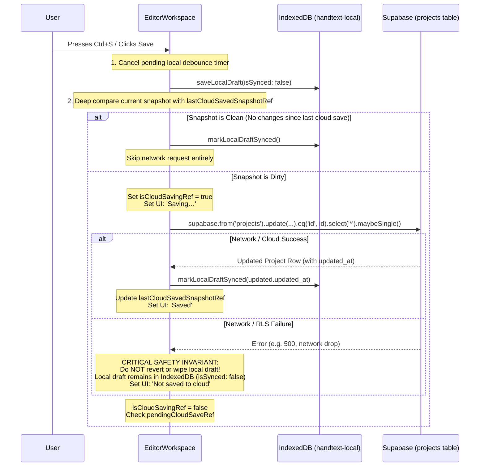

# HandText — Data and Persistence Architecture

> **Local-First Storage, Cloud Synchronization, and Document Model Evolution**  
> *Target Audience:* Full-Stack Engineers, Database Architects, AI Agents  
> *Last Updated:* September 2026  
> *Document Status:* Active & Canonical

---

## 1. Persistence Philosophy: Local-First Hybrid Architecture

HandText adopts a strict **Local-First Hybrid Persistence Architecture**. 

In high-intensity student authoring environments (e.g., preparing a 4,000-word university assignment), treating a remote cloud database as the direct target of typing keystrokes or formatting clicks is an anti-pattern. Campus Wi-Fi drops, browser tabs freeze, and repeated remote network calls trigger rate limits or PostgREST concurrency deadlocks.

To resolve this, HandText decouples **real-time draft preservation** from **cloud synchronization**:

1. **Local-First Fast Path**: Every keystroke, formatting action, and configuration tweak is persisted locally to browser IndexedDB with zero network overhead.
2. **Explicit Cloud Checkpoint Path**: Cloud synchronization to Supabase PostgreSQL occurs exclusively through explicit user actions (<kbd>Ctrl</kbd>+<kbd>S</kbd>, clicking "Save", or generating final pages).

---

## 2. Local Persistence Engine: IndexedDB `[CURRENT]`

### Technical Specification
- **Database Name**: `handtext-local`
- **Object Store**: `drafts`
- **Primary Key**: `handtext:draft:${userId}:${projectId}`
- **Schema Version**: `2` (Upgraded to resolve version collision and stale schema states)

### Data Record Model (`LocalDraftRecord`)
```typescript
export interface LocalDraftRecord {
  key: string;              // "handtext:draft:${userId}:${projectId}"
  userId: string;           // Supabase Auth UUID
  projectId: string;        // Project UUID
  draft: ProjectSnapshot;   // Complete snapshot of editable document state
  savedAt: number;          // Epoch timestamp (ms) of local write
  cloudUpdatedAt?: string;  // ISO timestamp of last known cloud state
  isSynced: boolean;        // True if identical to remote confirmed cloud state
}

export interface ProjectSnapshot {
  name: string;
  question: string;
  content: string;          // Rich HTML representation
  settings: HandwritingSettings;
  assignmentMode: boolean;
}
```

### Autosave & Debounce Mechanics
- **Debounce Window**: 1000ms.
- As the user types in `RichContentEditor` or toggles settings in `DesignPanel`, `EditorWorkspace` updates React state immediately and resets a 1000ms timer.
- When the timer fires, `saveLocalDraft()` executes a fast `readwrite` transaction on the `drafts` store.
- **Zero Network Activity**: Local autosave never initiates an HTTP or WebSocket request to Supabase.

### Local Draft Recovery Lifecycle
When a user opens a project (`/editor/$projectId`):
1. TanStack Query fetches the latest project row from Supabase.
2. `EditorWorkspace` simultaneously checks the local IndexedDB store for a matching key:
   `getLocalDraft(project.user_id, project.id)`.
3. If a local draft exists, its timestamp (`savedAt`) and sync state (`isSynced`) are compared against the remote `project.updated_at`:
   ```typescript
   const cloudUpdatedTimestamp = project.updated_at ? new Date(project.updated_at).getTime() : 0;
   const hasUnsyncedEdits = !localRecord.isSynced && !isProjectSnapshotEqual(localRecord.draft, initialSnapshot);
   const isLocalNewer = localRecord.savedAt > cloudUpdatedTimestamp && !isProjectSnapshotEqual(localRecord.draft, initialSnapshot);
   
   if (hasUnsyncedEdits || isLocalNewer) {
     // Restore local draft into active editor state
     setName(localRecord.draft.name);
     setDraft({
       question: localRecord.draft.question,
       content: localRecord.draft.content,
       settings: localRecord.draft.settings,
     });
     setAssignmentMode(localRecord.draft.assignmentMode);
     setSaveState("saved-locally");
     toast.info("Restored your local draft");
   }
   ```
4. This guarantees that if a user closed their laptop mid-sentence or suffered an internet blackout, their latest local work is never overwritten by an older cloud snapshot.

---

## 3. Cloud Persistence Engine: Supabase PostgreSQL `[CURRENT]`

### When Cloud Synchronization Occurs
Cloud synchronization is strictly gated to the following events:
1. User presses <kbd>Ctrl</kbd>+<kbd>S</kbd> or <kbd>Cmd</kbd>+<kbd>S</kbd>.
2. User clicks the **Save** button in the editor header.
3. User triggers full page generation ("Generate" button).

### Cloud Save Pipeline & Safety Invariants


### Critical Cloud Invariants
- **No Keystroke Requests**: Under no circumstances should typing or character-level formatting fire a Supabase PATCH request.
- **Local Draft Immunity**: If a cloud save fails (e.g., due to an expired session or network timeout), the local draft must **never** be discarded. It remains safely pinned in IndexedDB with `isSynced: false`, and the UI displays *"Could not save to cloud. Your draft is saved locally."*
- **PostgREST Query Resilience**: Single-row updates must use `.maybeSingle()` with an explicit null check rather than `.single()` to avoid HTTP 406 crashes if zero rows are returned.

---

## 4. Current Database Schema Model `[CURRENT]`

In the current live database (`aojpzcmwretmknftvzde.supabase.co`), project data is organized relationally with a JSONB configuration column:

```sql
-- Current Schema: public.projects
CREATE TABLE public.projects (
  id UUID PRIMARY KEY DEFAULT gen_random_uuid(),
  user_id UUID NOT NULL REFERENCES auth.users ON DELETE CASCADE,
  name TEXT NOT NULL DEFAULT 'Untitled answer',
  question TEXT NOT NULL DEFAULT '',
  content TEXT NOT NULL DEFAULT '',
  settings JSONB NOT NULL DEFAULT '{}'::jsonb,
  page_count INTEGER NOT NULL DEFAULT 0,
  status TEXT NOT NULL DEFAULT 'draft',
  created_at TIMESTAMPTZ NOT NULL DEFAULT now(),
  updated_at TIMESTAMPTZ NOT NULL DEFAULT now()
);
```

### What Each Field Stores
- `name`: User-facing title of the assignment/document.
- `question`: Dedicated prompt/question string when "Assignment Mode" is enabled.
- `content`: Sanitized rich-text HTML string containing `<p>`, `<h1>`, `<h2>`, `<ul>`, `<table>`, and inline formatting `<span>` elements with `data-scale`, `data-color`, and `data-highlight`.
- `settings`: A JSONB dictionary storing all typography, paper, ruling, margin, header, and footer configurations matching the TypeScript `HandwritingSettings` interface.
- `page_count`: Integer recording the total physical pages generated on the last generation run.
- `status`: Lifecycle indicator (`draft` | `generated`).

---

## 5. Architectural Evaluation: Relational vs. Document-Oriented Storage `[CURRENT]` vs. `[PROPOSED]`

An ongoing architectural evaluation addresses whether HandText should evolve its persistence model toward a formalized document-oriented representation.

### Current Architecture `[CURRENT]`
- **Model**: Relational row with flat HTML string in `content` and JSONB in `settings`.
- **Strengths**:
  - Extremely simple to query and update via standard PostgREST CRUD operations.
  - Zero serialization overhead when syncing with the browser `contenteditable` container.
  - Compact row size.
- **Weaknesses**:
  - Requires parsing HTML on every preview render pass.
  - Document-level metadata (such as page-specific header/footer overrides) must be stuffed into the generic `settings` JSONB blob.

### Proposed Architecture `[PROPOSED]`
- **Model**: Unified Document Model splitting relational metadata from a structured JSONB document hierarchy:
  - **Relational Columns** (for indexation and dashboard listings): `id`, `user_id`, `name`, `page_count`, `status`, `updated_at`.
  - **Document Column (`doc JSONB`)**:
    ```json
    {
      "schemaVersion": 1,
      "metadata": {
        "assignmentMode": true,
        "question": "Explain Kirchoff's Voltage Law"
      },
      "settings": {
        "styleId": "natural",
        "ink": "blue",
        "page": { "size": "a4", "paper": "ruled" },
        "pageOverrides": {}
      },
      "content": {
        "format": "html",
        "raw": "<p>In this lab...</p>"
      }
    }
    ```
- **Evaluation Status**:
  - This architecture has been analyzed and proposed in design discussions to prepare for page-specific overrides.
  - **STATUS**: `[PROPOSED]`. It has **NOT** yet been implemented in the active database schema or application code. The live system remains on the `[CURRENT]` relational structure documented in Section 4.

---

## 6. Summary of Persistence Rules for Engineers and AI Agents

1. **Typing / Editing**: → Local IndexedDB autosave ONLY (1000ms debounce).
2. **Formatting**: → Local IndexedDB autosave ONLY.
3. **Cloud Persistence**: → Explicit Save button / <kbd>Ctrl</kbd>+<kbd>S</kbd> / Page Generation ONLY.
4. **Network Guard**: → Under no circumstances trigger Supabase calls on input changes.
5. **Recovery Guard**: → Always preserve local IndexedDB drafts if a cloud call fails or returns an error.
